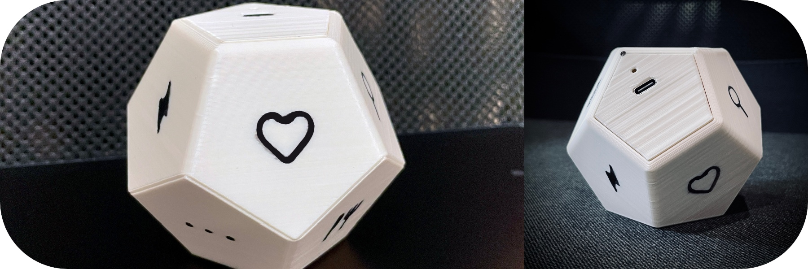

# Cube Time Tracker ESP32

**:exclamation: This project is still under heavy development. First release is coming!**
 

 

 

Your personal time tracker in a form of cube. Each wall has a symbol which describes activity you might be doing. Flip the wall and the clock is ticking! Cube pairs with a **desktop app**, which allows you to see your insights on time you spent on particular activities. 
 

In order to start with your own DIY tracker you will go through these steps:
- :hammer: Obtain and build hardware (esp32 board, accelometer board, battery and enclosure)
- :arrow_double_up: Upload firmware to ESP32 board
- :mag: Connect to tracker with desktop app
- :rocket: Go thru initial configuration process

## Found a bug?
If you found a :bug: please report it via issues tab

## Troubleshooting
- Firebeetle board not recognized (OS X): http://www.wch-ic.com/downloads/CH341SER_MAC_ZIP.html

## Known issues
Time drifts +/- 5%. Changed from RTC clock source from internal RC to internal 8 MHz clock; didn't help
