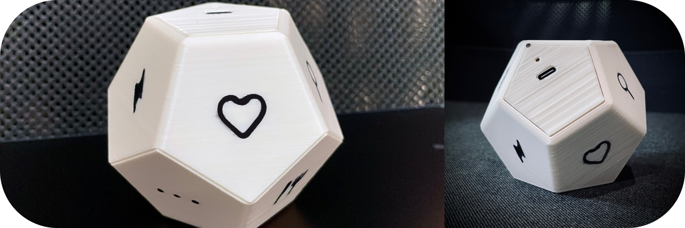
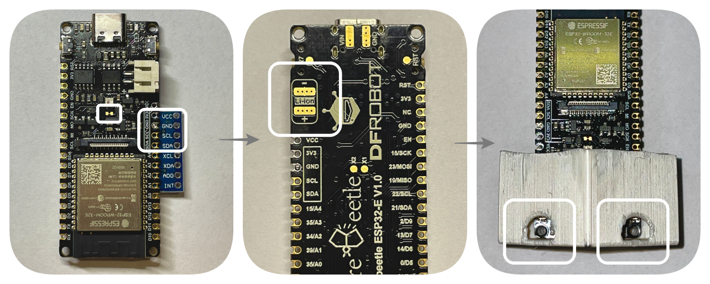

# Cube Time Tracker ESP32

**:exclamation: This project is still under heavy development. First release is coming!**
 

 

 

Open source time tracker in a form of cube :game_die: Each wall has a symbol which describes activity you might be doing. Flip the wall and the clock is ticking! Cube pairs with a **desktop app** (under development), which shows you the insights into time you spent on particular activities. 
 

In order to start with your own DIY tracker you will go through these steps:
- :hammer: Obtain and build (esp32 board, accelometer board, battery and enclosure)
- :arrow_double_up: Upload firmware to ESP32 board
- :mag: Connect to tracker with desktop app
- :rocket: Go thru initial configuration process

# Hardware Build

## Components

Alright, time to build the tracker :game_die: Here is the list of parts you need :gear:

- [DFRobot Firebeetle ESP32](https://wiki.dfrobot.com/FireBeetle_Board_ESP32_E_SKU_DFR0654) (currently the only supported board)
- [MPU6050 Accelometer](https://components101.com/sensors/mpu6050-module)
- Battery (lithium) of your choice, single cell, with the right shape you can fit any up to 1000mAh. Mind that Firebeetle has no any protection circuit
- 3D printed parts (models available in docs/ )
  - Enclosure 
  - Insert which will hold your electronics
- Two tiny screws

Equipment you might need for assembly:
- Soldering iron
- Tape (duct or double sided)
- Screwdriver

## Assembly

- Cut the trace between exposed pads (be careful not to cut the other traces)
- Solder MPU6050 to Firebeetle. Match the pins from MPU :exclamation: Mind that MPU's VCC pin should connect to 3V3 on the beetle
- Take your battery and solder its terminals to pads on the beetle's bottom side
- Attach battery to Firebeetle board (suggestion: tape)
- Put your assembled electronics into the printed insert and thighten screws through the holes in insert

:checkered_flag: I hope you didn't screw it up (lol you get it, the last step with screws).
 
Connect USB-C cable, charge the battery and upload software!

## Hardware additional info

### Power consumption

An average current consumption on FireBeetle is around 500uA. Time on battery you can calculate as follows:  `90% * capacity[mAh] / avg_consumption[mA] = time[h]`.   Other boards might yield different results. When looking for an alternative board pay attention to what components on the board are powered from 3V3 rail, an example is USB to UART converter present on almost every board, they are usually connected to 3V3, so they will drain your battery. Lolin32 Lite seems to be the closest suitable alternative, but since it has no connection from battery to ESP32 you might to hack a resistor divier and connect it to some analog input.
 
Cube app will remind you about low battery level.

# Software Build

Time to upload software into the tracker. Or you might want to tweak the software a lil bit on your own?

### Build 
Project is build with [PlatformIO](https://platformio.org) framework.

- Install PlatformIO extension in VSCode
- PIO Home > Platforms > Embedded > Download and install "Espressif 32" **version 6.1.0** (includes ESP-IDF v5.0.1)
- Make sure you cloned/pulled this git repository
- Download submodules `git submodule update --init`   NimBLE repo in {project}/app/ble/esp32-nimble-cpp should be downloaded. If not, use `git submodule add https://github.com/h2zero/esp-nimble-cpp` and then update submodule
- Build project and upload binaries using PlatformIO buttons/shortcuts at the bottom status bar

Off you go! In case of errors - clean and build.

## Troubleshooting
- Firebeetle board not recognized (OS X): http://www.wch-ic.com/downloads/CH341SER_MAC_ZIP.html

Otherwise... Plug the cube and run PlatformIO serial monitor, lookup the errors in the console

## Found a bug?
If you found a :bug: please report it via issues tab

## Known issues
Time drifts +/- 5%. 8.5 MHz internal RTC clock issue - to be fixed in upcoming ESP-IDF updates, you can implement it already using [esp-idf issue commit](https://github.com/espressif/esp-idf/commit/a0ed82525ec03bfe3a3edc46fbbb2c8449db3e14)
