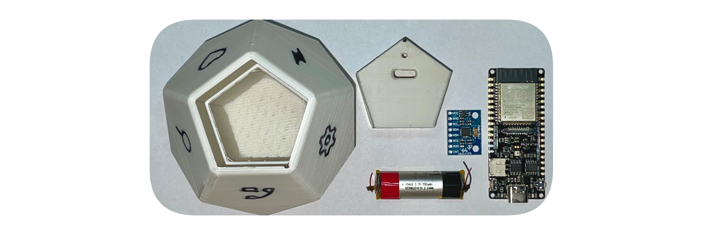

# Hardware Build Guide

 

Alright, time to build the tracker :game_die: Let me list the parts you need:

- :computer: [DFRobot Firebeetle ESP32](https://wiki.dfrobot.com/FireBeetle_Board_ESP32_E_SKU_DFR0654)
  - Firebeetle is currently the only supported board. The closest alternative is Lolin32 Lite (will include some additional steps)

- :balance_scale: [MPU6050 Accelometer](https://components101.com/sensors/mpu6050-module)
- :battery: Battery (lithium) of your choice, single cell, with the right shape you can fit any up to 1000mAh. Mind that Firebeetle has no any protection circuit
- :hammer_and_wrench: 3D printed parts (models available in docs/ )
  - Enclosure 
  - Insert which will hold your electronics
- :nut_and_bolt: Two tiny screws

Equipment you might need for assembly:
- :probing_cane: Soldering iron
- :paperclip: Tape (duct or double sided)
- :screwdriver: Screwdriver

 

### Assembly

- Solder MPU6050 to Firebeetle. Match the pins from MPU :exclamation: Mind that MPU's VCC pin should connect to 3V3 on the beetle
- Take your battery and solder its terminals to pads on the beetle's bottom side
- Attach battery to Firebeetle board (suggestion: tape)
- Put your assembled electronics into the printed insert and thighten screws through the holes in insert

I hope you didn't screw it up (lol you get it, the last step with the screws).
 
Connect USB-C cable to upload software - continue in [Software Build Guide](softwareBuild.md)