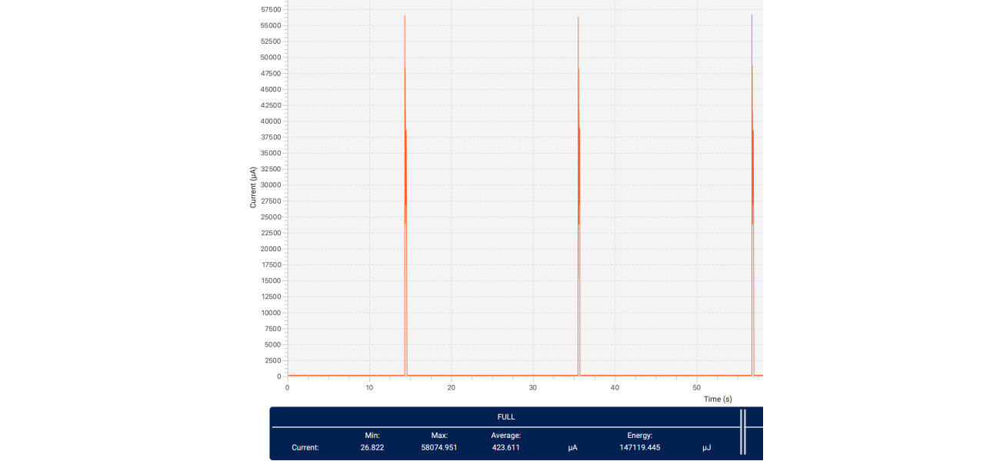

# Hardware Build Guide

 

## Components

Alright, time to build the tracker :game_die: Let me list the parts you need:

- [DFRobot Firebeetle ESP32](https://wiki.dfrobot.com/FireBeetle_Board_ESP32_E_SKU_DFR0654) (currently the only supported board)

- [MPU6050 Accelometer](https://components101.com/sensors/mpu6050-module)
- Battery (lithium) of your choice, single cell, with the right shape you can fit any up to 1000mAh. Mind that Firebeetle has no any protection circuit
- 3D printed parts (models available in docs/ )
  - Enclosure 
  - Insert which will hold your electronics
- Two tiny screws

Equipment you might need for assembly:
- Soldering iron
- Tape (duct or double sided)
- Screwdriver

 

## Assembly

- Solder MPU6050 to Firebeetle. Match the pins from MPU :exclamation: Mind that MPU's VCC pin should connect to 3V3 on the beetle
- Take your battery and solder its terminals to pads on the beetle's bottom side
- Attach battery to Firebeetle board (suggestion: tape)
- Put your assembled electronics into the printed insert and thighten screws through the holes in insert

:checkered_flag: I hope you didn't screw it up (lol you get it, the last step with screws).
 
Connect USB-C cable, charge the battery and upload software! - continue in [Software Build Guide](softwareBuild.md)

## Hardware additional info

### Power consumption

An average current consumption on FireBeetle is around 1.3 mA (to be improved) Deep sleep consumption is 400uA. Time on battery you can calculate as follows:  `90% * capacity[mAh] / avg_consumption[mA] = time[h]`.  Other boards might yield different results. When looking for an alternative board pay attention to what components on the board are powered from 3V3 rail, an example is USB to UART converter present on almost every board, they are usually connected to 3V3, so they will drain your battery. Lolin32 Lite seems to be the closest suitable alternative, but since it has no connection from battery to ESP32 you might to hack a resistor divier and connect it to some analog input.
 
Cube app will remind you about low battery level.